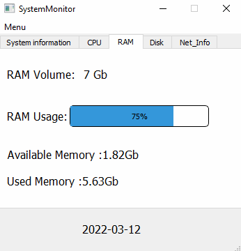

# SystemMonitor
<b>Программа Python с графическим интерфейсом для мониторинга системной информации компьютера.</b>



## Запуск
 В терминале перейдите в каталог программы и введите:
```
Для отображения информации в терминале, введите:
python Monitor.py
```

```
Для отображения информации в графическом 
интерфейсе, введите:
python main.py
```
## Разработчики проекта
Р.А.Гиндуллин,
А.П.Хромченков,
Е.Н.Ботоногов

Данная работа сделана в рамках Проектного практикума 3-А (Курсовой проект за 4 семестр)
